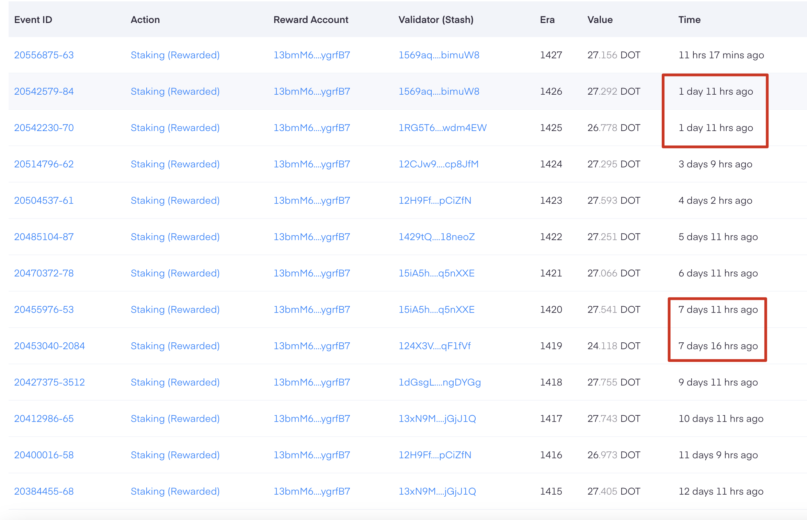

Thank you for choosing [ExinPool](https://mixin.one/codes/791f20db-51ce-4af2-918b-7496864ab833)! ExinPool currently operates nodes for XIN, ETH (ETH-Restaking), DOT, SOL, and AXS. To ensure transparency, we guarantee that all node assets are staked on-chain, and you can verify this via [this link](https://support.exinpool.com/docs/Verify).

### Distribution of Node Rewards

The distribution of rewards at ExinPool is based on the actual amount received on-chain. During the operation of nodes, the timing of reward distribution from ExinPool may not always be on schedule, but we assure that all due rewards will ultimately be distributed to participants.

Below are the typical reward distribution schedules for our nodes, along with explanations for any special cases:

#### XIN

- **Distribution Schedule**: Variable.
- **Explanation**: Since the migration of Mixin nodes to the Safe network, the distribution model for XIN rewards has changed and no longer guarantees daily rewards. Currently, ExinPool cannot distribute XIN rewards daily or predict when rewards will be received. Rest assured, once ExinPool receives XIN rewards, we will immediately distribute them, including making up for any previously undistributed rewards.

#### ETH (ETH-Restaking)

- **Distribution Schedule**: ETH2.0 rewards are distributed daily; ETH-Restaking reward timing is to be determined.
- **Explanation**: As soon as we receive ETH-Restaking rewards, they will be distributed promptly.

#### DOT

- **Distribution Schedule**: Approximately every 24 hours, per staking epoch (Era).
- **Explanation**: Typically, rewards are distributed daily. If there is a delay, we will distribute the rewards immediately upon receipt.
- **Example**: As shown in the image below, there are occasional deviations from the 24-hour distribution schedule for DOT nodes, with rewards being distributed twice in one day.

#### SOL

- **Distribution Schedule**: Every two to three days.
- **Explanation**: The SOL reward cycle (Epoch) is approximately two and a half days. Delays may occur, but rewards will be distributed according to the actual cycle.

#### AXS

- **Distribution Schedule**: Monthly, typically between the 24th and 26th of each month.

### Additional Information

- Due to the need for manual verification of reward distributions, delays may occasionally occur. Please be assured that ExinPool will expedite the distribution of any delayed rewards and strive to minimize such occurrences to provide reliable and stable services.
- ExinPool takes daily snapshots of node participation. Regardless of the length of the reward distribution cycle, we average the rewards based on the number of days rewards were not distributed. This ensures that even if you exit a node before rewards are distributed, you will still receive your due rewards.

If you have any questions or need assistance, please feel free to contact us. We look forward to continuing to serve you and ensuring your investment yields maximum returns.
