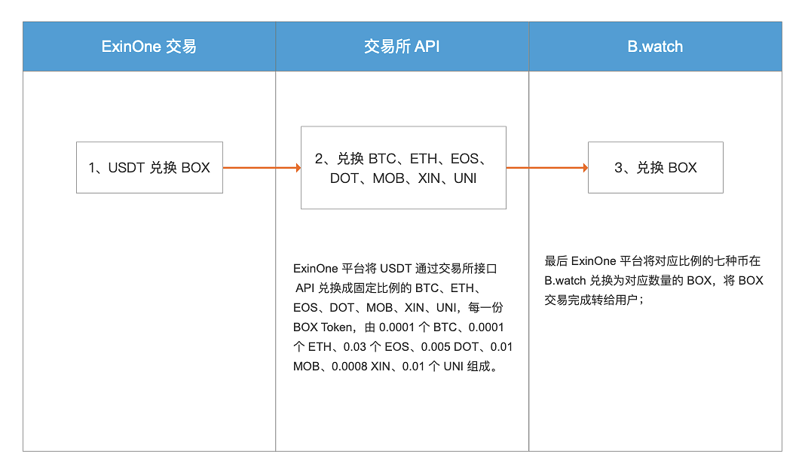
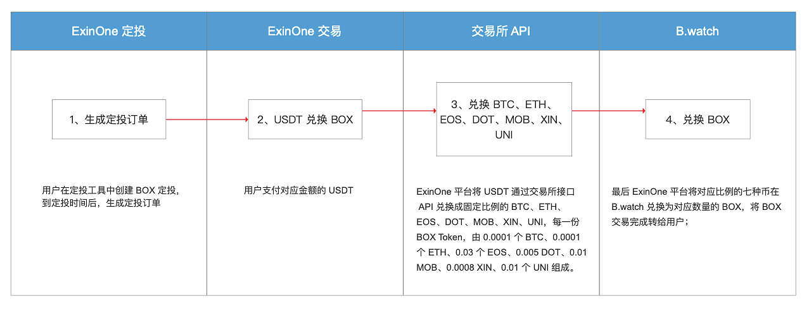

亲爱的用户：

BOX 为李笑来个人设计发行的 ETF，是由 BTC、ETH、EOS、DOT、MOB、XIN、UNI 按照固定比例兑换而来，目前用户在 ExinOne 进行的 BOX 有关的交易买入/卖出，均为 ExinOne 平台代理交易，具体的实现过程如下：

**1、USDT 兑换 BOX**

用户在 ExinOne 平台使用 USDT 兑换 BOX 时，其背后的实现过程如下：

**2、定投 BOX**

用户在 ExinOne 平台的定投工具中定投 BOX，其背后的实现过程如下：

**需要注意的是：**

- ExinOne 只是 BOX 的代购平台，一切的购买、赎回规则以 BOX 项目官网 B.watch 说明为准；
- ExinOne 跟 BOX 项目无任何利益关系；
- ExinOne 平台不承诺永久提供申购、赎回等服务，ExinOne 有权随时终止提供 BOX 的代理交易服务，最终解释权归 ExinOne 团队所有！

您使用 ExinOne 平台的 BOX 交易业务时，将默认为已充分阅读、了解并接受以上申明。

若您不同意或者对以上申明有疑问，请暂停使用平台的 BOX 交易服务。

感谢您对 ExinOne 团队的支持！