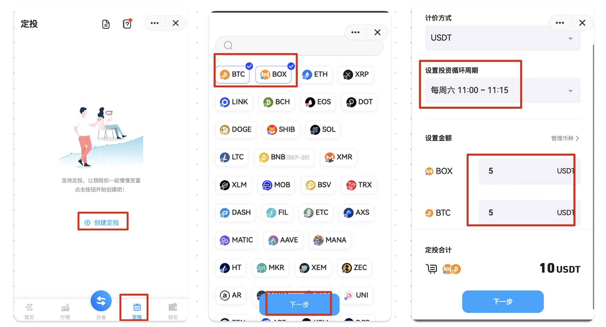
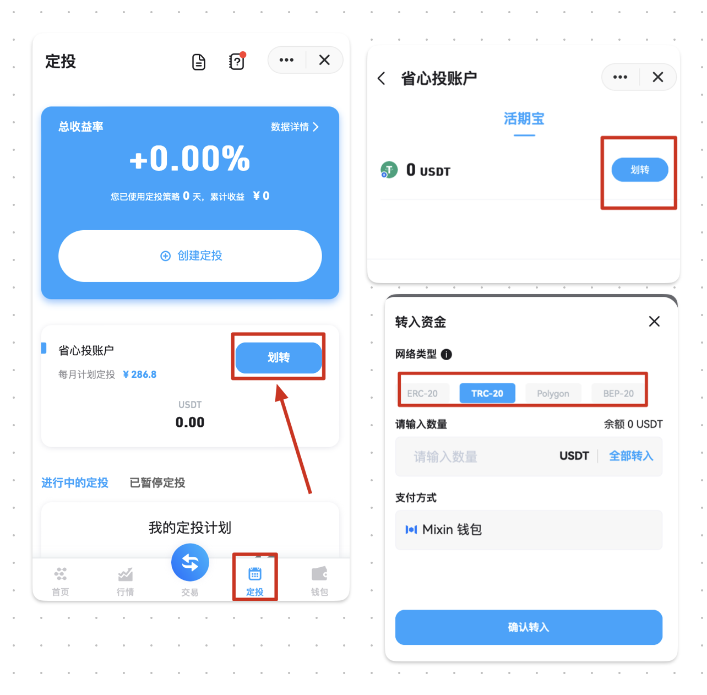

ExinOne 现已支持定投功能，您可以通过 ExinOne [机器人](https://mixin.one/codes/310e1f2b-2fc7-4ae0-ae2c-2f4c189808b1) 进行定投设置，自动定投。

## 设置定投计划

在 ExinOne 的 「定投」页面，您可以自由设置对单个代币或多个代币进行定投，创建属于您自己的定投策略。

首先，请根据定投指引进行定投设置：

## 存入定投资金

完成定投设置后，为保证定投计划的顺利执行，请预先存入定投资金，如下图，将定投资金 USDT 存入活期宝，活期宝内余额充足，即可自动定投。

如上图，活期宝支持多版本 USDT 存入，您可以根据自己 Mixin 钱包持有的 USDT 版本，选择对应的 USDT 存入活期宝。

## 怎么获得 USDT

请通过 TIGA-Safe (7000104225) 机器人购买 USDT，购买成功后将自动转入您的新系统 Mixin 钱包，可用于定投。

由于目前 ExinOne 支持多版本 USDT定投，您可以选择价格合适的 USDT 版本进行购买，存入活期宝即可自动定投。
