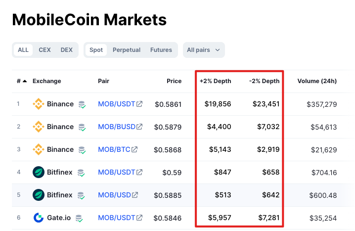

ExinOne 是您在 Mixin 内熟知的交易工具，它可以为您提供安全、隐私、方便地交易各大交易所上线的代币的服务。

- 安全：诸如 BTC、ETH、MOB、BOX 等代币，交易完成后代币直接入账到您的 Mixin 钱包，ExinOne 并不托管您的资产，部分代币

- 隐私：使用 ExinOne 无需进行 KYC，无需提供手机号，甚至您无需登陆即可使用 ExinOne 进行交易。
  - 您可以给 ExinOne 授权以获取更多服务：		
    - 个人信息，包括 Mixin ID，昵称，头像等，用于为您关联交易账户、活期宝等账户及相关配置 & 订单信息；
    - （非必选）钱包余额：交易及内置 Mixin 钱包为您展示您的钱包资产余额
    - （非必选）钱包流水：用于在 ExinOne 内置的 Mixin 钱包上展示您的钱包流水

- 方便：使用 ExinOne 相当于您注册了 Binance、OKX、Gateio、Bybit 等交易所的账号，您可以在 ExinOne 上直接交易相关交易所的代币，无需去各交易所单独注册账号，KYC，充提币等等。

- 价格好：ExinOne 对接市面上最好的交易所的交易深度，为您提供有竞争力的交易价格。

现为您介绍 ExinOne 的业务模式。

## 名词引入

**交易深度**

好的交易深度意味着更低的价格影响，以 MOB 的[交易深度](https://coinmarketcap.com/currencies/mobilecoin/#Markets)情况举例：

如图，可以看到，如果您在 Binance 上交易 MOB，想把 MOB 的价格提高或者降低 2%，需要大约两万美金，但是如果在 Bitfinex 上，只需要大约一千美金。

所以，如果您希望有稳定的价格不吃亏的话，交易 MOB 时，使用 Binance 会比使用 Bitfinex 能给您带来更好的价格。

**资金池**： ExinOne 提供交易等服务所持有的资金情况，ExinOne 需要在各交易所、Mixin、链上建立资金池，以维持业务的正常运转。

**链上充提币**：由于资金池不是无限的（为了保证安全，也不能把所有资金都用于业务上），所以时常需要在各个平台间进行调拨，这就会涉及到区块链的链上充提币操作，链上充提币会产生一定的费用，可能是几美金到几十美金不等，并且有一定的到账时间，可能是几分钟到几十个小时（可以简单类比为快递）。

**流动性**：这也是 ExinOne 资金池相关的一个概念，指一个代币维持日常运营的能力，流动性好，相关代币可以自由流通，没有任何限制，流动性不好，相关代币会有一定的限制，比如入账仅支持入账到 Mixin 账户。

## 资金池调拨详解

以 BTC、ETH、USDT 为例：

ExinOne 需在交易所和 Mixin 内分别存放一定数量的 BTC、ETH、USDT，假设分别是 20 个 BTC，40 个 ETH、600,000 个 USDT

初始资金池假设是：

| 代币 | Mixin   | 交易所  |
| ---- | ------- | ------- |
| BTC  | 10      | 10      |
| ETH  | 20      | 20      |
| USDT | 300,000 | 300,000 |

为了方便计算，假设 BTC 价格为 $30,000，ETH 价格是 $2,000

此时，A 用户支付 30,000 USDT 购买 1 个BTC，B 用户卖出 15 个 ETH，得到 30,000 USDT，则：

由于 A 用户买 BTC，所以 ExinOne 在 Mixin 内的 USDT 增加了 30,000 个，BTC 少了 1个，同时交易所的账号内，USDT 支出了 30,000 个去买到了 1 个 BTC。

由于 B 用户卖 ETH，所以 ExinOne 内 ETH 多了 15 个，付给用户三万美金。同时，ExinOne 去交易所卖掉了 15 个 ETH，得到三万个 USDT

所以此时的资金池情况变成了：

| 代币 | Mixin   | 交易所  |
| ---- | ------- | ------- |
| BTC  | 9       | 11      |
| ETH  | 35      | 5       |
| USDT | 300,000 | 300,000 |

用户交易完着两笔订单后，ExinOne 在 Mixin 这边的 BTC 没有少很多，USDT 恰巧没变化，但是 ETH 多了 15 个，交易所的 ETH 只剩五个了，如果再有用户卖 ETH，ExinOne 在交易所的 ETH 就可能不够卖了，所以此时需要提币，补充交易所里 ETH 的资金池。

ExinOne 需要把 Mixin 内一定数量的 ETH 提到交易所，以保证用户依然可以通过 ExinOne 顺利地把 ETH 卖出。

以上是日常的资金池调拨情况，由于 ExinOne 可以设置一定的预警阀值，所以可以提前进行充提币操作，用户层面是无感的。但如果恰巧来了极端行情，会发生什么？

## 极端行情的应对

此处的极端行情可能是暴涨或者暴跌的单边行情，一般来说有以下规律

- 暴涨时：更多用户选择卖币 —— 将各种代币转换为稳定币 USDT
- 暴跌时：更多用户选择“抄底” —— 使用 USDT 购买各种代币。

**暴涨时**

当暴涨时，由于用户的卖币需求更高，所以可能出现以下几种情况：

1. 交易所相关代币被卖空，需要等待交易所补充上相关代币后继续交易
2. ExinOne 的 USDT 被卖空了（都转给了用户），会出现延迟放币的情况，待 USDT 补充完毕，您就可以收到 USDT 了。

**暴跌时**

暴跌时，大家抄底，可能出现以下情况：

1. ExinOne 的相关币可能会被买光，此时会提示您”延迟放币“，待资产补充到位后会自动转给您。
2. 交易所的 USDT 被消耗完，此时则需要等待资产调拨，待调拨完成后可以继续抄底。

所以，在一定条件下，您可能会遇到 [延迟放币](./DelayedRelease) 的情况，请您耐心等待，提币正在路上了。

:::info 小知识 

如果您遇到交易某个代币时，ExinOne 提示您资金池不足需要延迟放币，您同意并在等待了，您可以通过机器人 7000103056 查看，一般会在「充值」页面看到相关币有一定数量的充值，这个充值可能就是 ExinOne 在补充资金池，充值到账后，您就可以收到您购买的代币了。

同时，这个机器人也可以查看充值到账的时间，如果您发现长时间没有充值的情况，也可以咨询我们了解细节。  

:::info

---

## 「仅支持入账到交易账户」的原因

众所周知，Mixin 钱包是一个安全的去中心化钱包，大家非常愿意将资产存入 Mixin 钱包以安全地存储自己的资产，而 ExinOne 提供的交易账户是一个由 ExinOne 管理的中心化的账户，用户自然会担心自己的资产存在交易账户里是否安全。

提到这些，首先我们需要了解交易账户的具体介绍，请看[这篇文章](/docs/Features/TradingAccount)，里面讲述了交易账户的作用：

1. 质押资产获取借币额度；
2. 为 ExinOne 提供流动性；
3. 方便地在 Mixin 内交易在各大交易所上线的代币。

可以看到，交易账户实质上提供了三个功能，用途如下：

**质押借币**

ExinOne 提供质押借币服务，您可以通过将资产质押在 ExinOne 的交易账户、活期宝或者参与 ExinPool 的节点理财，获得一定的“资产分”，您可以最多借出跟资产分一致的 USDT。

您质押在 ExinOne 上的资产会被 ExinOne 妥善保管，比如 BTC，ExinOne 实际上绝大多数的 BTC 都通过 Mixin 内的多签钱包被妥善地保管着，交易所和 Mixin 内只保存少量 BTC 维持基本的交易所需，同时，ExinOne 未来将提供多签质押服务，您质押的资产将交由您参与多签保管。

**提供流动性**

交易账户的前身叫“流动池”，正是这个名字的由来。

上文提到，ExinOne 需要在各平台间建立资金池，需要较大的资金池来维持业务的正常运转，为此，ExinOne 上线了“流动池”功能，用户可以将自己的资产存入流动池，可以获得一定的借贷额度，同时贡献较高还会获得一定的奖励，流动池的作用是帮助 ExinOne 在各平台间维系一定的资产流动性，维持业务的运行，基于用户的信任以及 ExinOne 自身的发展，ExinOne 对于主流币的流动性需求已经满足，当下更关注的是用户存入交易账户的资产安全性，所以在维持业务运行的最小范围内，将绝大多数资产通过多签等形式进行更为安全可靠的保管。

而对于近期上线的一些代币，由于业务的调整，现已不再需要流动性作为支撑即可正常开展业务，如若流动性充足，ExinOne 可开放相关代币提币到 Mixin 钱包，整体上更加灵活。

**提供交易服务**

根据上文的介绍，您已经大致了解了 ExinOne 提供交易的过程，但如果每次交易，ExinOne 都必须将代币转账到您 Mixin 钱包的话，会有很多限制：

- 相关代币流动性不足如何处理？
- Mixin 不支持此公链代币怎么办？

这就是「[交易账户](/docs/Features/TradingAccount)」要解决的问题：

- 限制部分代币仅能入账到交易账户，所以就不需要所有币都提过来 Mixin 了，用户可以直接交易相关代币；
- 解决了 Mixin 不支持的公链的代币交易问题，也可以自由交易；
- 解决了部分代币充提币时间太久的问题：在交易账户内交易即可；
- 甚至有可能部分代币涉及到合约置换，空投新币，旧币因此失效，Mixin 本身不支持空投，可以通过交易账户完成此操作。

「仅支持入账到交易账户」的交易业务背后的实现原理是您的部分（比如 ETH 等链上转账时间太久的）或全部（比如您在交易账户里看到的，用户购买资金价值相对较低的）代币被保存在相关的交易所里，ExinOne 承诺您购买的被保存在相关交易所的资产帮助被用作它途，但 ExinOne 无法承诺在交易所的资产 100% 安全可靠没有风险。

## 交易所的安全？

现在您已经基本了解了 ExinOne 与交易所之间的业务模式，现在就可以自己判断相关的风险了。

一般来说在交易所出现严重事故（暴雷）之前，会出现提币相关的一些新闻，ExinOne 可以应对的策略有：

- 适当降低存在相关交易所内的资产；
- 迁移交易对到其它平台；

但为了维持交易的稳定，ExinOne 无法将所有资产完全转移，所以影响可以说是必然发生，请您知悉。

如果遇到极端情况，ExinOne 将及时采取相应的应对措施，但也请您及时关注相关信息，如有必要，可以及时出售相关资产，确保自己的资产安全。

