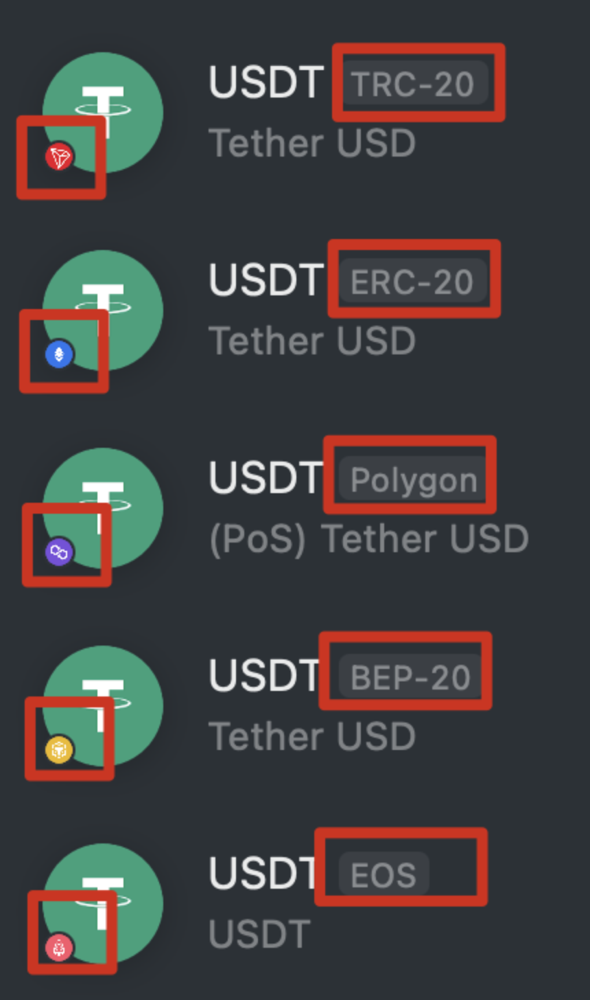

由于您可能无法详细了解近期发生的事件和对自己的影响以及可能的应对方案，本文章将分两个板块为您介绍近期发生的事件：

- <a href="#faq">常见问题 QA</a>
- <a href="#detail">事件公告</a>

:::note

请注意：此文章由 Exin 团队根据 Mixin 团队及 BOX 团队相关的公开信息整理，并根据对公开信息的理解，整理出以下内容。

信息有时效性，部分内容理解可能不准确，如有偏差，请以 Mixin 官方 & BOX 官方表述为准。

:::

**公开信息来源**

- Mixin 产品动态：7000101914
- 冯晓东的小迷圏：7000100118
- BOX 持仓群：7000105122

<h2 id="faq">常见问题QA</h2>

Q：发生了什么？

A：9 月 23 日，Mixin Network 网络遭受黑客攻击，黑客盗走了价值约 1.5 亿美金的资产，主要盗走了 BTC、ETH 和 **USDT-ERC20**，受损比例大约为：BTC 10%，ETH 90%，USDT 90%。

Q：还有什么币受影响吗？

A：由于 BOX 成分里有 BTC 和 ETH，所以也受影响了，大约受损 7.34%，其它代币不受影响，比如 USDT-TRC20 不受影响。

Q：我的资产受影响吗？

A：如果您持有 BTC、ETH、USDT-ERC20、BOX，那么您的相应资产是受影响的，不管您是什么时候得到的这些币。

Q：我现在钱包里的币不是受损了吗，为什么感觉没变化？

A：当前（Mixin 新系统上线前），您看到的资产还是您原有的资产，以 BTC 为例，假设您有 1 个 BTC，由于 BTC 被盗了 10%，所以实际上您这 1 BTC 对应着 0.9 BTC 的实际资产，损失 10%，Mixin 新系统上线后，您的 1 BTC 可以兑换成 0.9 BTC 和 黑客攻击日，0.1BTC 等值的 USDT 债券。

Q：债券是什么，如果不兑换是不是就等于没损失？

A：由于此次黑客盗走的资产价值巨大，Mixin 暂时无法偿付资产，所以会以黑客盗币日的价格，将受损的相关资产折算成 USDT 债券，未来赔付，如果您不兑换的话，将受损资产保留在老系统内，这些资产可能会面临着无法使用的问题，所以建议兑换提币到新的系统内。

Q：现在可以充提币吗，预计什么时候可以？

A：Mixin 目前暂时还无法支持充提币，根据 Mixin 官方的信息，预计本月底（10 月底）上线新系统，再过约两周，开放充提币，即 11 月中旬开放充提币。

Q：我现在可以交易吗，交易的资产受损吗？

A：可以交易，但有几点说明：

- 由于 ETH 和 USDT-ERC20 受损严重，ExinOne 暂不支持卖出 ETH，也不支持使用受损严重的 USDT-ERC20 买币，但其它版本 USDT 不受影响，比如 USDT-TRC20 没有受损，可以正常使用；

 - BTC 和 BOX 也有受损，但为了满足用户的交易需求，ExinOne 支持了受损的 BTC 和 BOX 交易，请注意：一旦您卖出受损的资产，意味着您放弃领取未来 Mixin 发放的债券，ExinOne 将收取债券作为交易手续费，不再额外收取费用；
 - 如果您持有不受损的 USDT-TRC20，可以通过交易 BTCNEW、BOXNEW、ETHNEW 来获得不受损的相关代币；
 - 其它代币交易如常，不受影响。

Q：什么是 USDT-ERC20，为什么有的 USDT 受损，有的不受损？

A：如下图，这次受损的是蓝色角标的 ERC20 版本 USDT，如果您需要交易，可以交易红色版本的 TRC20 版本 USDT。

<h2 id="detail">事件公告</h2>

以下信息来自：

- Mixin 产品动态：7000101914
- 冯晓东的小迷圏：7000100118
- BOX 持仓群：7000105122

> 【Mixin 公告】香港时间 2023 年 9 月 23 日凌晨，Mixin Network 云服务商数据库受到黑客攻击，导致主网部分资产遭受损失，目前已经联系  Google、区块链第三方安全公司 slowmist （慢雾科技）进行协助追查。经初步核实，涉及资金金额约为 2 亿美金，目前 Mixin Network 的充值和提现服务已经暂停，经各节点讨论磋商将在确认并修复漏洞后第一时间开放，期间转账不受影响。

> 【Mixin 公告】Mixin Network 923 黑客攻击事件进展更新如下：
>
> Mixin 团队目前在最高优先级的处理剩余资产的安全，其次是数据的安全和漏洞修复，具体的细节请耐心等后续的事件报告。
>
> 一些问题汇总：
>
> 具体有哪些资产被盗或受损？
> 目前还在统计中，因为匿名缘故统计难度较大，这也是为什么与网传数据不一致的原由。
>
> 现在能充值或提现吗？
> 抱歉不能，充值和提现服务已暂停。
>
> 什么时候可以提现/赔付？
> 抱歉目前无法给出准确时间。目前最高优先级的事情是确保剩余资产安全，其次保全所有数据并修复已知问题然后部署新系统，最后制定详细的资产处理方案后才能公布具体的重启提现时间，请大家耐心等候。
>
> 黑客事件发生后的充值和提现会怎样？
> 提现会全部取消，充值资产不受黑客事件影响。
>
> 哪些 Mixin 生态的机器人或应用受到此次事件的影响？
> 所有基于 Mixin 钱包的都会受到影响，如果项目团队在黑客事件之前有将资产提现出 Mixin 钱包，这部分资产不受此次黑客事件影响，具体处理方式请咨询相关团队。
>
> ---
>
> 注意：Twitter、Telegram 等渠道涌现了许多假消息，请大家注意不要盲目转账造成额外的损失。

> 具体方案的公告可能还需要时间，但是我们基本厘清恢复了钱包资产，大概分配会完全按照各个资产受损比例赔付。
>
> 主要受损币种是 BTC ETH 和 ERC20 USDT。相应大家可以得到的资产比例是
>
> BTC 90%
> ETH 30%
> ERC20 USDT 10%
>
> 需要特别注意，其他版本的 USDT 不受影响。上述数字还可能有细微变化，需要正式公告才能确定，但是变化不会超过上下 1% 的范围。USDT ERC20 损失过高，但是因为我们在资产分配完成后，会优先赔付，可能赔付时间不会太久。
>
> 其他币种有不同程度损失，但是我们团队准备使用现有资金并借钱购买相应资产 100% 赔付。对于一些特殊的合成币种，比如 BOX pUSD 做市的代币等等具体比例需要参考对应底层资产和相应的独立公告。
>
> 对于受损的三大币种我们计划以被盗当天的币价折算成美元债券来赔付。同时优先赔付 USDT ERC20 的受损者。这一计划需要完全等正式公告时才能明确，望大家理解。
>
> 之前之所以估算损失为 2 亿美金，是因为 Mixin 作为一个以隐私和去中心化为主设计的系统，统计与资产恢复非常困难，我们无法完全确定损失，现在我们也只是找回了部分。
>
> 这是大概情况，对此肯定有很多人不满意，但是这是考虑到整体情况我们能做出的最好决策。
>
> 再次表达歉意，这一切都是我个人责任，有任何问题可以这里直接聊天问我。包括今天下午的问题我都会一一回复。

> 有人问会不会大老先提现跑了，这个大家放心，我们给出的方案就是 100% 保证的情况下，大家全部提走都没问题。
>
> USDT 这个 10% 确实太少了，我们会优先赔付，只要大家信任我们给我们赚钱的机会，这些钱还是相对轻松的。
>
> 另外有人担心赔付能力问题，我们想说的是我们所有的计算，之所以这么久，就是因为我们希望数字完全精准，所以这个完全不需要担心，大家可以全部提空再充值回来没有问题。
>
> 现在的意思就是如果钱包里的 BTC 有 10 个的话，能拿回 9 个，ETH 有 10 个拿回 3 个，USDT 拿回 1 个。但是我们会按照受损比例最大的优先赔付。
>
> 大家说的对，这里用赔付这个词不太准确。其实就是现在大家可以拿回的自己的币的比例。就是这些相应比例的币 Mixin 里都还在。
>
> 再说明一下，大部分币种都可以全部拿回原来的币。现在这里说到的比例都是按照币本位全部拿回的。拿不回来的，我们只能先折算成美元计价的债券给到大家，后续赚钱还。
>
> 作一下措词的更正，大家如果有 10 个 BTC 就能拿回 9 个 BTC，如果有 10 个 ETH 就拿回 3 个 ETH，有 10 个 ERC20 USDT 拿回 1 个。没有拿回的部分折算成美元价值，我们发放等值美元的债券。
>
> 另外我们可以保证其他币种大部分拿回的都是 100% 原来的币，当然某些特殊合成币种类似 BOX 等可能有特殊情况，需要参考相应社区。
>
> 真的非常抱歉，文字也写得漏洞百出，这次出的事故过于严重，非常抱歉。

> 大家请注意，我们反复提醒不家不要频繁交易，因为最后结果是认币不认人，而且 Mixin 内的交易都是无法回滚的。
>
> 对于 USDT ERC20 损失这么大的比例，我们会给出债券，优先购买。当然流通的代币性债券我们现在无法保障，需要等后续发放时再看。债券的权益等现在也无法给出任何保证。
>
> 真的非常抱歉，现在依然有大量技术与产品问题需要处理，回复可能不及时。
>
> 至于赔付能力问题，我们的利润并不是固定的，虽然过去有 1000 万美元一年，后续可能突然更多，也可能更少。但是大家给我们做出更好的产品的机会，我们赚钱能力只可以上涨。
>
> 大比例持有 USDT 的人，我们给出的只能是优先赔付的债券。
>
> 现在只是先把没有损失的币分配好，等结束之后再看受损的赔付怎么更满意，希望大家理解。我们总不能拖着一直没有方案。

关于 BOX：

> # BOX 预案提案
>
> 这是一次补充说明，以及 “预案” 的 “提案”，具体细节，有待讨论与商榷。
>
> BOX 此次因 Mixin Network 被盗事件受损情况概要如下：
>
> 每个 BOX 原本对应：
>
> * 0.0001 BTC
> * 0.0001 ETH
> * 0.0008 XIN
> * 0.01 UNI
> * 0.005 DOT
> * 0.03 EOS
> * 0.01 MOB
>
> 受损后，每个 BOX 原本应该对应：
>
> * 0.00009 BTC
> * 0.00003 ETH
> * 0.0008 XIN
> * 0.01 UNI
> * 0.005 DOT
> * 0.03 EOS
> * 0.01 MOB
>
> 其中，丢失的 0.00001 BTC 按照 9 月 23 日价格，约为 \$26580 x 0.00001 = \$0.2658, \$1593 x 0.00007 = \$0.11151，两者合计为 \$0.37731。
>
> 由于 BOX 持有者中有一部分购买了理财产品，所以他们抵押的 BOX 对应的一部分 BTC（约 5000 BTC）未保存在 Mixin Netowrk 中，所以，BOX 中的 BTC 有一部分未受到影响，按照 5000 BTC 未受损计算，那么，BOX 受损的 BTC 数量应为 (8743.5324 - 5000) x 10% = 374.35324。
>
> 注意：这其中的数据需要反复核实，我在之前计算出约为 7.27% 损失的时候，BOX 总计发行量是按照 86,229,778.00 计算的，而非 87,435,324.00……（当时 b.watch 无法正常显示数据，我用的是我的 excel 表格里未最终实时更新的数据）这其中差了 1,205,546 个 BOX，即，受损量差了 120.5546 x 10% = 1.205546 BTC 和 120.5546 x 70% = 84.38822 ETH…… 按照当日价格计算，受损金额略高于之前的计算，整体受损略高于 7.27%，实为 7.34%，即，有千分之七的差异 —— 当然，这个数字最终还需要根据 Mixin Network 的债券定价重新调整。
>
> 为了 BOX 的续存，以及相关决策的稳定，现预案如下，供大家讨论：
>
> * BOX 成份依然长期保持不变（只在真正必要的时候调仓）
> * BOX 持有者，迁徙到 Mixin Network Safe 版本的时候，约有 7.34% 的 BOX 将转换为 Mixin 债券，发放到所有 BOX 持有者手中。
>   * 所有 BOX 用户，如果你原本有 100 个 BOX，那么，你能转入新版本 Mixin 的 BOX 数量约为 92.66 个，而剩下的 7.34 个 BOX 将转换成 Mixin 债券。
>   * 在 Mixin Network 之外的 BOX（例如，转入 BigOne 的那些），在转回 Mixin 的时候，也会同样转换。
>
> 这么做的好处是，BOX 本身不需要调整，不需要发行新的 BOX2，将来的流动性也不会因为变成了两个而各有不同…… 尽量秉承 “能不变就不变” 的原则。
>
> 另外，BOX 在此次事件恢复之后，会按照年化 1% 支付托管费用，虽然目前尚未确定托管方案 —— 托管方案的制定与实施会非常复杂，涉及到的成本也可能比想象的高，具体细节和说明，我会在确定之后，与大家详细沟通。1% 的托管费用扣取，按日计算，参考传统股票市场中 ETF 的管理费收取办法。核心之一是，不再完全依赖 Mixin Network 本身（尽管我依然相信 Mixin Safe 是个相对更好的解决方案），尽量做到规避 “单点风险”。
>
> 关于托管与安全的复杂性，我会找时间详细说明，详细沟通 —— 因为这真不是随便哪个人都可以搞定的事情…… 数字资产管理，无论是对哪个人，无论是对怎样的金额量级，长期来看，都是极其艰难且又不可能 100% 安全的难题。
>
> 另外，在 Mixin Safe 上线之后，BOX-USDT/BOX-PUSD 的流动池会尽早恢复，以便满足小额的变现需求。

> 这次被盗事件的发生不仅让大家损失了大量资产，还有这么长时间无法进行正常的交易，真的非常抱歉。关于被盗币种的赔付，因为金额巨大，我们只能选择按照被盗时的美元价值折算成债券进行赔偿。
>
> 因为有三种被盗的资产，债券也会分成三种。我们计划所有债券都是用币的形式发放，大家可以自由交易。然后我们有思路来整合一个统一的债券币种，方便大家使用。
>
> 这周我们主要是要尽快完成所有安全防护工作，并且完成现在提现中的资产的退回工作。下周计划上线新的主网，完成新的系统的 API 设计。
>
> 如果黑客的资产顺利追回了，肯定都是全部返还给大家的，这个完全可以放心。
>
> 另外如果债券已经发放完毕后，钱才追回来，那这个过程中大家的债券可能已经发生了交易。这时候我们的思路是债券对应着相应币种的分配权，也就是如果债券卖给了别人，然后 BTC 追回了，那持有这个债券的人就能按照比例分 BTC。
>
> 当然对于债券的这些方案大家都可以提出建议。
>

> 我们昨天处理完成的是从 Mixin 提现之后退回到 Mixin 钱包，如果有从其他地方充值到 Mixin 的，只能等新版本系统上线后全额到账。
>
> 这都是为了安全起见，现在的系统不接受任何的充值操作，请大家注意不要充值任何币种。
>
> 充值的处理我们确实在 Mixin 钱包里没有明显的提示到位，但是暂时我们最快最安全的处理方式就是要确保新系统的尽快上线了，耽误了大家的时间实在抱歉。
>
> 虽然现在充值和提现不能正常工作，但是在 Mixin 内的用户转账是完全没有问题的。
>
> 最近依然有很多充值到 Mixin 的资产，因为系统关闭了充值功能，所以暂时无法入账，这部分资产都是没有损失的，可以在系统恢复之后自动入账，抱歉给大家造成的不便。

> 经过谨慎严格的评估，我们对 Mixin 系统的升级有了大概的规划。这次升级主要目标是一次性的将现有系统升级到 Mixin Safe 为核心的架构，同时尽可能确保用户体验和开发者体验不变，做到平滑迁移。
>
> 我们会用 3 周到 4 周的时间确保新系统的上线，这包括新版本的 Mixin Kernel 主网，新版本的 Mixin Messenger，以及一些大家常用的机器人的迁移上线。在新系统上线后，大家可以领取相关代币的债券并且可以正常使用新版本的各种机器人进行正常的交易。在新系统上线后，我们会进行大约两周的系统检查，然后才会开放充值与提现。
>
> 我理解大家对现状的焦虑，但是经过这次事件之后，我们必须谨慎又谨慎，杜绝任何可能的其他安全事故。对于大家关心的 Mixin Safe 安全问题，首先我们可以明确的给大家提供多家安全机构的审计报告与过程，经过这次事故，安全机构对 Mixin Safe 的审计只能是更加严格。其次在我们过去的宣传上也频繁的说过 Mixin Safe 才是 Mixin 真正 1.0 版本的开始，我们过去一直自豪的讲 Mixin 六年多时间没有出过安全事故，但这次在 1.0 即将到来之时的一次事故将我们的记录彻底打断了。但正因为这次事故，我们才更谨慎，我们的未来一定会更大，有了 Mixin Safe 的安全基础和这次的教训，Mixin 也会更安全。

> 这次黑客事件依然在调查中，预计还需要很长时间才能出结果。不过我们新系统在这个月底的上线计划不变，在上线后就算调查还没结束，我们也会公开相关的技术细节。
>
> 另外我们预期下周会给出正式的债务处理方案，如何发行债务代币等等都会明确下来。这次攻击让大家损失惨重，实在抱歉。
>
> 现在新系统的开发还是很顺利的，团队核心工作就是确保新系统的上线。我们当然知道这样一个系统需要的工作量是巨大的，但是这次出了这么大的问题我们也只能克服各种困难拿出一个可靠的新的系统来提供服务。
>
> 新系统的上线是有很多步骤的，包括旧的主网的调整，新的主网的测试与上线，核心 API 的上线，旧版本兼容 API 的上线，充值提现的开放。
>
> 现在我们已经完成了主网的调整与测试，核心 API 也已经完成了整体调试，Messenger 也正在适配中。按照现在的进度，我们在月底上线新系统，并且确保大部分面向开发者的 API 没变化，时间上还是非常有保障的。
>
> 今天我们已经完成了 Mixin Messenger 与新系统的适配，可以便捷的使用最新的交易格式发送交易，所以整体来看新系统在月底完整上线问题不大。抱歉给大家造成了损失，还有这段时间很多功能无法正常使用。

> 我们还在做债务代币化的方案，为了合规和后续 Mixin 的发展，还有大量的法律工作在处理，现在还没有完成，但是我们已经明确的是会发放债务代币。
>
> 一个月前的黑客攻击事件对大家造成了重大损失，我们一直在加班加点开发更安全更好的服务，想办法补偿大家的损失，这一个月我们已经完成了新系统的大量测试。
>
> 预期月底前会上线新系统，到时充值也计划同步开放，之前充值未到账的会统一入账到新系统。
