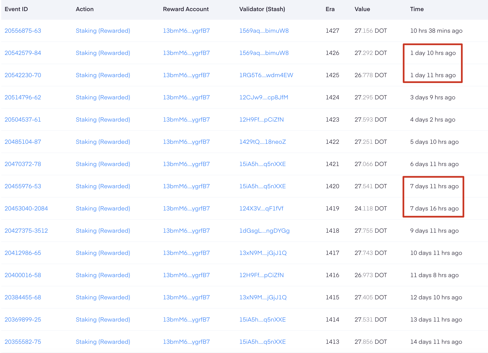

感谢您选择 [ExinPool](https://mixin.one/codes/791f20db-51ce-4af2-918b-7496864ab833)！ExinPool 目前运营着 XIN、ETH（ETH-Restaking）、DOT、SOL 和AXS 节点。为保证透明度，我们承诺所有节点资产均质押在链上，您可通过 [此链接](https://support.exinpool.com/zh-CN/docs/Verify) 验证相关信息。

### 节点收益的发放方式

ExinPool 的节点收益发放基于链上实际收到的数量。节点运营过程中，ExinPool 收到节点发放的收益可能不会完全按时，但我们保证所有应发的收益最终都会发给节点参与者。

以下是各节点常规的收益发放周期，以及可能的特殊情况说明：

#### XIN

- **发放周期**：不固定。

- **说明**：自从 Mixin 节点迁移到 Safe 网络后，XIN 节点的收益发放模式已发生变化，不再保证每日收到节点收益。因此，ExinPool 目前无法实行每日固定发放 XIN 节点收益，也无法预测具体收益到账时间。但请放心，一旦 ExinPool 收到 XIN 节点收益，我们将立即进行收益分发（包括补发任何过去未发放的收益）。

  

#### ETH（ETH-Restaking）

- **发放周期**：ETH2.0 节点收益每天发放；ETH-Restaking 收益发放时间待定。
- **说明**：一旦收到 ETH-Restaking 收益，我们会尽快进行收益发放。

#### DOT

- **发放周期**：每个节点收益周期（Era）大约是 24 小时。
- **说明**：通常情况下，收益每天发放。如有延迟，我们将在收到节点奖励后立即补发。
- **案例**：如下图，DOT 节点偶尔会出现没有按照 24 小时发放收益的情况，而是之后连续发放了两次节点收益。

#### SOL

- **发放周期**：每两到三天一次。
- **说明**：SOL节点收益周期（Epoch）大约为两天半，特殊情况可能会延迟发放，但会根据实际情况补发。

#### AXS

- **发放周期**：每月一次，通常在每月的 24 日至 26 日之间。

### 其他事项

- 由于节点发放收益需要人工复核，偶尔可能会出现未如期发放收益的情况。请您放心，ExinPool 会尽快补发任何延迟的收益，并努力减少此类情况的发生，以提供稳定可靠的服务。
- ExinPool 每天对节点的参与情况进行资产快照。不论节点的收益发放周期有多长，我们都会按照历史未发放收益的天数，将收益进行平均分配。这意味着，即使您在收益发放前退出节点，也能保证您获得应得的收益。

如有疑问或需要帮助，请随时联系我们，我们期待持续为您服务，并确保您的投资收益最大化。

